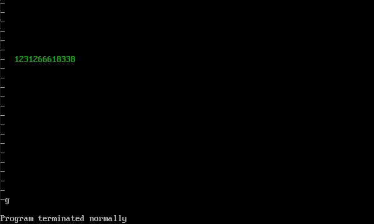

### 任务1：显示字符串

---

#### 问题

显示字符串是显示工作中经常要用到的功能，应该编写一个通用的子程序来实现这个功能。我们应该提供灵活的调用接口，使调用者可以决定显示的位置（行、列）、内容和颜色。

#### 子程序描述

- 名称：show_str
- 功能：在指定的位置，用指定的颜色，显示一个用0结束的字符串。
- 参数：(dh)=行号(取值范围0~24)，(dl)=列号(取值范围0~79)，(cl)=颜色，ds:si指向字符串的首地址
- 返回：无
- 应用举例：在屏幕的8行3列，用绿色显示data段中的字符串

#### 函数实现

```c
assume cs:code

data segment
db 'Welcome to masm!',0
data ends

code segment

start:		mov dh,8	;行号
            mov dl,3	;列号
            mov cl,2	;颜色

            mov ax,data
            mov ds,ax
            mov si,0	;数组下标
            call show_str

            mov ax,4c00h
            int 21h

show_str:	push cx
            mov ax,0b800h	;显存的初始段地址，字符从0开头
            mov cl,dh
            mov dh,0
            mov ch,0

s:			add ax,0ah	
            loop s
            mov es,ax	;目的行位置
            pop cx
	
do:			push cx		;保存一下颜色
            mov cl,[si]	
            jcxz ok		;根据字符是不是为0来判断字符串是否结束
                    ;判断的时候要确保返回前没有压入新东西
                    ;否则出栈的不是返回的地址
            mov ax,dx
            add ax,ax
            mov di,ax	;第3列，即从第6个字节开始
            mov es:[di],cl	;根据列依次放入
            pop cx
            mov es:[di+1],cl;放置颜色			
            inc si
            inc dx		;列数+1
            jmp do

ok:			pop cx		;将压入的颜色弹出
			ret

code ends

end start
```

#### 实现结果

使用g命令直接运行完程序


### 任务2：解决除法溢出的问题

---

#### 问题

前面讲过，div指令可以做除法。当进行8位除法的时候，用al存储结果的商，al存储结果的余数；进行16位除法的时候，用ax存储结果的商，dx存储结果的余数。 可是，如果结果的商大于al或ax所能存储的最大值，那么将如何？

#### 子程序描述

名称：divdw

功能：进行不会产生溢出的除法运算，被除数位dword型，除数为word型，结果为dword型

参数：(ax)=dword型数据的低16位；(dx)=dword型数据的高16位；(cx)=除数

返回：(dx)=结果的高16位，(ax)=结果的低16位；(cx)=余数

#### 提示

给出一个公式：

X：被除数，范围：[0, FFFFFFFF]

N：除数，范围：[0, FFFF]

H：X高16位，范围：[0, FFFF]

L：X低16位，范围：[0, FFFF]

int()：描述性运算符，取商，比如，int(38/10)=3

rem()：描述性运算符，取余数，比如，rem(38/10)=8

**公式：X/N = int(H/N)\*65535 + [rem(H/N)\*65535+L]/N**

这个公式将可能产生溢出的除法运算：X/N，转变为多个不会产生溢出的除法运算。

公式中，等号右边的所有除法运算都可以用div指令来做，肯定不会导致除法溢出。

#### 函数实现
在实现过程中，只要注意哪个寄存器保存商，哪个寄存器保存余数就行了

```c
assume cs:code

code segment

start:	mov ax,4240H
        mov dx,000FH
        mov cx,0ah
        call divdw

        mov ax,4c00h
        int 21h

divdw:	mov bx,ax	;把最初的低16位保存在bx中
        mov ax,dx
        mov dx,0	;则(dx)=0,ax是之前dx的值
        div cx		;做除法，余数保存在dx中，商在ax中

        push ax		;余数dx当做下一次的高16位，ax是最终的高16位，保存下来
        mov ax,bx	;ax拿到之前的低16位
        div cx		;余数在dx中，商在ax中
        mov cx,dx	;将余数放入cx中

        pop dx		;dx得到最终的高16位，ax就是最终的低16位
        ret

code ends

end start
```


### 任务3：数值显示

---

#### 问题

编程，将data段中的数据以十进制的形式展示出来。

要将数据用十进制形式显示到屏幕上，要进行两步工作：

(1) 将用二进制信息存储的数据转变为十进制形式的字符串；

(2) 显示十进制形式的字符串。

#### 子程序描述

名称：dtoc

功能：将word型数据转变为表示十进制数的字符串，字符串以0为结尾符。

参数：(ax)=word型数据；ds:si指向字符串的首地址

返回：无

应用举例：编程，将数据12666以十进制的形式在屏幕的8行3列，用绿色显示出来。使用第一个子程序show_str。

#### 函数实现

```c
assume cs:code

data segment
dw 123,12666,1,8,3,38
db 16 dup (0)
data ends

code segment

start:	mov bx,data
		mov ds,bx	;ds段保存原始数据
		add bx,1h	;段号+1，即加16个字节	
		mov es,bx	;es段保存转换后的字符串
	
		mov si,0	;ds那段
		mov di,0	;es那段
		call dtoc	;调用格式转换函数

		mov dh,8
		mov dl,3
		mov cl,2

		mov ax,es	
		mov ds,ax	;将ds设置到字符串es那段
		mov si,0
		call show_str	;调用字符串输出函数

		mov ax,4c00h
		int 21h

;将ds段的数据转化为十进制字符串，保存到es段中
dtoc:	push cx
		mov cx,6	;知道个数，就不用判断零了
					;因为如果是16个字节，就不能判断零了
dtocs:	mov ax,[si]	;取一个数
		push cx
		mov dx,0	;dx之前没用过，当做计数器
dtocd:	mov ch,0
		mov cl,0ah
		call divdw

		add cl,30h	;将得到的余数+30h得到字符
		inc dx
		push cx		;得到的是反的，所以先放入栈中
		mov cx,ax
		jcxz dtok	;商是零，就结束
		jmp dtocd	;不是零，就继续除
				
dtok:	mov cx,dx	;位的个数
dtoput:	pop dx
		mov es:[di],dl	;字符是单字节的，虽然保存的是双字节的
		inc di
		loop dtoput
		add si,2
		pop cx
		loop dtocs
		pop cx

;修改一下之前的函数，支持8位除法
divdw:	mov bl,al	;把最初的低8位保存在bl中
		mov al,ah
		mov ah,0	;则(ah)=0,al是之前ah的值
		div cl		;做8位除法，余数保存在ah中，商在al中
		
		mov ch,al	;余数ah当做下一次的高8位，al是最终的高8位，保存下来
		mov al,bl	;ax拿到之前的低8位
		div cl		;余数在ah中，商在al中
		mov cl,ah	;将余数放入cl中

		mov ah,ch	;ah得到最终的高8位，al就是最终的低8位，cl保存余数
		ret
		

show_str:push cx
		mov ax,0b800h	;显存的初始段地址，字符从0开头
		mov cl,dh
		mov dh,0
		mov ch,0

s:		add ax,0ah	
		loop s
		mov es,ax	;目的行位置
		pop cx
	
do:		push cx		;保存一下颜色
		mov cl,[si]	
		jcxz ok		;根据字符是不是为0来判断字符串是否结束
				;判断的时候要确保返回前没有压入新东西
				;否则出栈的不是返回的地址
		mov ax,dx
		add ax,ax
		mov di,ax	;第3列，即从第6个字节开始
		mov es:[di],cl	;根据列依次放入
		pop cx
		mov es:[di+1],cl;放置颜色			
		inc si
		inc dx		;列数+1
		jmp do

ok:		pop cx		;将压入的颜色弹出
		ret
code ends

end start
```

#### 实现结果



#### 主要描述

**函数调用关系**

主函数 start

- 格式转换函数 dtoc
  - 取数函数 dtocs
    - 位数处理函数 dtocd
      - 取余函数 divdw
    - 循环输出函数 dtoput

- 字符串输出函数 show_str