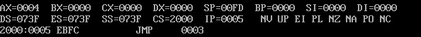

## 环境安装

- 在software中，有DOSBox和debug，分别解压到各自的文件夹
- 安装DOSBox，不安装debug
- 双击 Options.bat

- 直接滑到末尾，挂载debug.exe，MOUNT是挂载，C是参数，后面是debug.exe的保存位置，最后两行直接执行命令

- 输入dds:0，查看是否正常输出

## 预备知识

### r命令：寄存器

---

- 功能：查看、改变CPU寄存器的内容

- 查看寄存器内容

- 修改寄存器内容（-r 寄存器名）

### d命令：内存

---

- 功能：查看内存中的内容，使用"d 段地址:偏移地址"的格式，列出128（即16*8）个内存单元的内容

- 显示格式为——每行首地址 前8个字节：后8个字节 ASCII码显示
  - 若没有对应的ASCII码，就使用' . '来代替

- 偏移量不为0时如何显示——显示为空，如1000:9，前1000:0-1000:8的内容不显示，也是显示128个单元

- 显示指定单元区间的内容，使用“d 段地址:起始偏移地址 结尾偏移地址”，如“d 1000:0 9”

### e命令：修改内存

---

- 功能：修改内存中的内容
- 直接修改

- 询问修改（输入后点击空格，再输入下一个）

- 输入字符（单引号，双引号都可以）

- 输入字符串（双引号，双引号都可以）

- 输入汇编指令

### u命令：翻译为机器指令

---

- 功能：查看机器码对应的机器指令

### t命令：执行指令

---

- 功能：执行指令（首先应将CS和IP指向保存指令的位置）

- 连续键入t，依次执行

### a命令：写汇编指令

---

- 功能：直接输入汇编命令，自动将命令翻译为二进制

## 实验开始

### 任务1：写入汇编指令，逐条执行，观察各寄存器变化

- 首先修改CS:IP为1000:0

- 先将汇编指令写入内存中

- 依次执行并查看各寄存器中的内容变化

- 第1条

- 第2条

- 第3条

- 第4条

- 第5条

- 第6条（可以看出AX发生了溢出）

- 第7条

- 第8条

- 第9条

- 第10条

- 第11条

- 第12条

- 第13条

- 第14条（Al发生了溢出）

### 任务2：计算2的8次方

- 将指令写入内存中（默认CS:IP已经修改为2000:0）

- 依次执行，查看结果
- 第1条

- 第2条

- 第3条

- 第4条

- 最后结果（0100H，即$16^2$，即$2^8$）

### 任务3：查看主板信息并尝试修改

---

- 主板ROM的生产日期，在内存FFF00H~FFFFFH的某些单元中
- 找了一下，结果是30 31 2F 30 32 2F 39 32，对应的字符串为“01/01/92”，其中30H对应的十进制ASCII码为48，对应的字符是'0'

- 试图修改该生产日期
- 尝试后无法进行修改，进一步说明ROM的内容是只读的，无法进行修改的

### 任务4：向指定内存单元填写数据

---

- 向B8100H内存空间写入数据，修改后屏幕的第二行出现了彩色的字母
- 在8086pc机中，B8100H保存的是显存的内容，而且对应的是DOS屏幕第二行大概中间的位置
- 在B8100H的单元里，用16位内存来单元来存储要显示的信息，第一个8位保存字符的ASCII码，第二个8位保存字符的颜色，如30H是ASCII的48，即字符‘1’
- 比如 b800:0000这段内存 是显存部分，你在这段内存中写东西会直接反映在屏幕中，所以你会看到屏幕中一些变化，但是当你不再改变它时候，会别其他的数据覆盖掉，因为你每回一次车，屏幕要上滚，实际就是在往显存中写东西，你以前的东西就会被覆盖掉了

### 任务3、4的共同知识点

---

- 8086PC机的内存地址空间分配

00000H ~ 9FFFFH 主存储器RAM

A0000H ~ BFFFFH 显存地址空间

C0000H ~ FFFFFH 各类ROM