## 预备知识

- masm.exe在software文件夹中，之前的debug也打包在masm文件夹中，所以在之前DOSBox的选项中挂载解压后的masm目录即可（MOUNT挂载后又挂载，当然只有一个生效，所以去掉之前的挂载）
- Debug的p命令是中断调回命令，遇到int指令要使用p命令从程序跳回到DOS界面中
- Debug的q命令是退出debug模式的命令

## 实验开始

### 任务1：编写程序并逐步生成可执行文件

---

- 程序在code/t1.asm中
- masm t1; 直接生成目标文件t1.obj
- link t1; 直接链接出可执行文件t1.exe

### 任务2：逐步调试

---

- 使用Debug t1.exe来进行调试
- 修改要操作的栈空间内容（修改内容后方便查看代码功能）

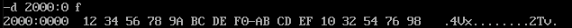

- 逐步调试

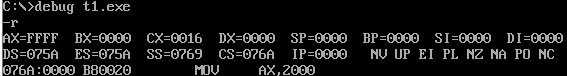

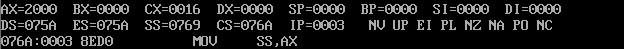

mov后栈顶为12H

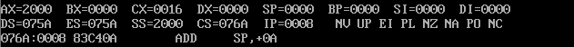

add后栈顶为EFH

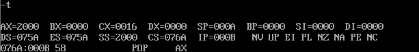

pop后栈顶为32H

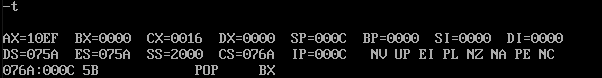

pop后栈顶为76H

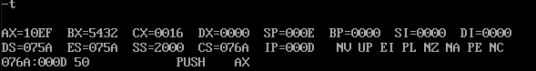

push后栈顶为32H

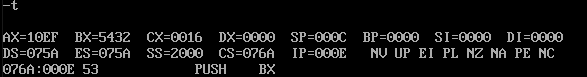

push后栈顶为EFH

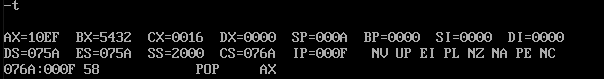

pop后栈顶为32H

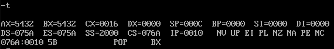

pop后栈顶为76H

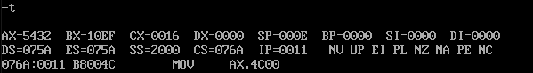

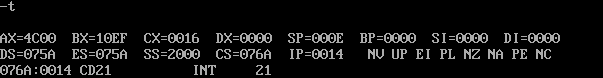

### 任务3：查看PSP的内容

---

- 头两个字节是CD 20

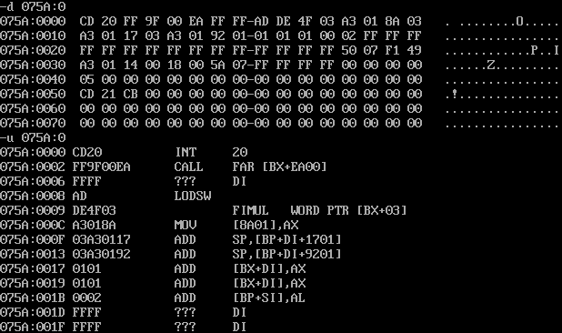