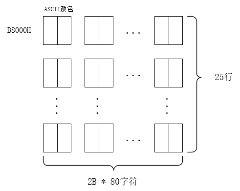
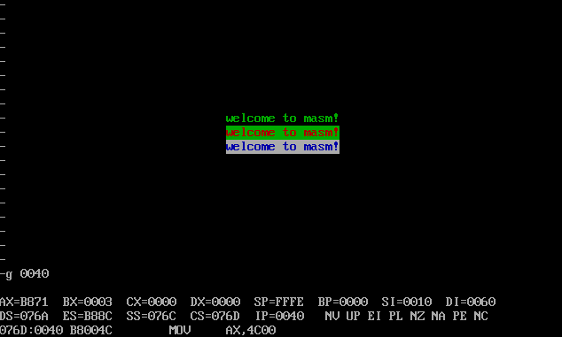

### 预备知识

---

- B8000H~BFFFFH 共32KB空间是显示缓冲区
- 总共8页，每页4KB，大约2000个字符，一般只显示第0页的数据
- 每行160字节，80个字符，每页总共25行
- 颜色属性的格式：
  - 7 6 5 4 3 2 1
  - 7：闪烁
  - 6 5 4 RGB 背景
  - 4 高亮
  - 3 2 1 前景




### 实验开始

---

**编程**：在屏幕中间分别显示绿色、绿底红色、白底蓝色的字符串 "welcome to masm!"

**分析**

- 一页有25行，中间的行应是第12行（行号为0~24），第12行偏移是6e0h~77fh，简化的段号为B86eh；
- 一行有160个字节，就是A0h个字节，‘welcome to masm!’有16个字符，32个字节，则行两边各有$（160-32）/2=64$个字符，从63开始，即3fh；但偶地址存放字符，所以从40h开始放字符；
- 屏幕中间，包括页中间和行中间

**思路**

- 两个数据段：一个数据段保存字符，另一个数据段保存颜色

**代码实现**

$exp9.asm$

```c
assume cs:code,ds:data,ss:stack

data segment 
db 'welcome to masm!'	;一个字符一个字节
db 02h,24h,71h 		;三种颜色
data ends

stack segment 
dw 0,0,0,0,0,0,0,0
stack ends

code segment
	
start:	mov ax,data
        mov ds,ax
        mov ax,stack
        mov ss,ax
        mov si,16

        mov cx,3
        mov bx,0
        mov ax,0b86eh	;页中间的段号,b开头前面加0
        push ax
s0:		pop ax		;方便下次增加段号
        add ax,0ah	;一行是0ah个字节
        push ax
        mov es,ax
        mov di,0040h	;行中间的偏移
        mov si,0	;数据段中的字符偏移

        push cx

        mov cx,16
s:		mov al,[si]	;先把字符串拷贝进去
        mov es:[di],al
        mov al,[bx+16]
        mov es:[di+1],al

        add di,2
        add si,1
        loop s	

        pop cx
        inc bx
        loop s0
	
        mov ax,4c00h
        int 21

code ends

end start
```

**实现结果**

使用g命令: g 0040，0040是 $mov ax,4c00h$ 语句的位置

