## mov、add、sub指令

### mov指令

---

- mov 寄存器，数据（正确）

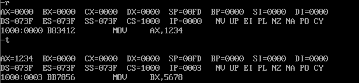

- mov 寄存器，寄存器（正确）

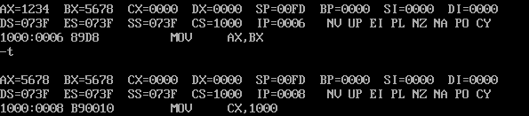

- mov 寄存器，内存单元（正确）

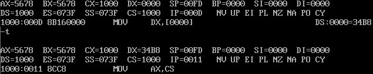

- mov 寄存器，段寄存器（正确）

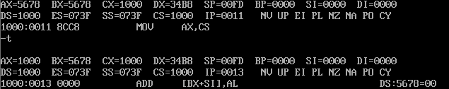

- mov 段寄存器，数据（错误）

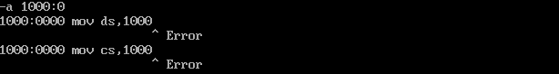

- mov 段寄存器，寄存器（正确）

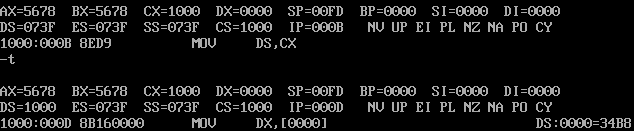

- mov 段寄存器，内存单元（正确）

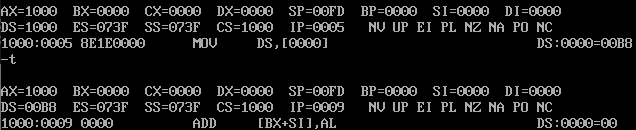

- mov 段寄存器，段寄存器（错误）

- mov 内存单元，数据（错误）

- mov 内存单元，寄存器（正确）

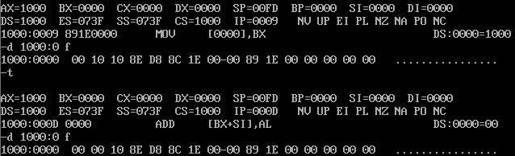

- mov 内存单元，内存单元（错误）

- mov 内存单元，段寄存器（正确）

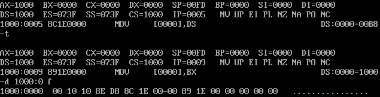

### add指令

---

- add 寄存器，数据

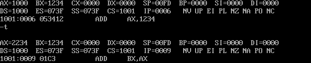

- add 寄存器，寄存器

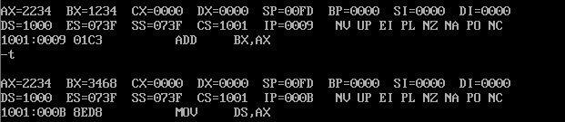

- add 寄存器，内存单元

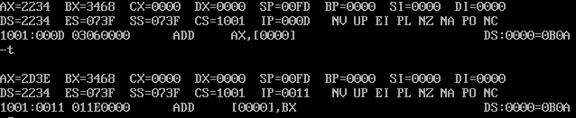

- add 内存单元，寄存器

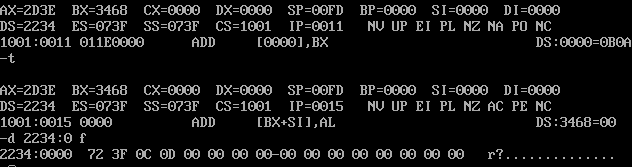

- 段寄存器不能做add

### sub指令(原理同add)

---

- sub 寄存器，数据
- sub 寄存器，寄存器
- sub 寄存器，内存单元
- sub 内存单元，寄存器

- 段寄存器不能做sub